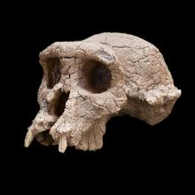

```{r setup, include=FALSE}
knitr::opts_chunk$set(echo = TRUE)
```


```{r needed libraries, include=FALSE}
library(tidyverse)
library(leaflet)
```


## *Sahelanthropus tchadensis*!



This fossil dates to between ~7-6 million years ago and thus may be the earliest hominin known. It was found in the Toros-Menalla area of the Djurab Desert of northern Chad. 

```{r  echo=FALSE}

map_sahel <- leaflet()  %>% 
  addTiles() %>%  
  addMarkers(lng=18, lat=17, popup="aprox location of Sahelanthropus tchadensis") %>% setView(lng = 18, lat = 17, zoom = 2)

map_sahel
```


The fossil was [first published in 2002](https://scholar.harvard.edu/files/dlieberman/files/2005a.pdf), with subsequent material published [in 2005](https://scholar.harvard.edu/files/dlieberman/files/2005a.pdf).  Scientists argued that it was bipedal based mostly on the placement of the *foramen magnum*, the large hole at the base of the skull through which the spinal column attaches to the skull. Hominins tend to have this hole placed more towards the front of their skull to support upright posture. Debate exists, though, about how forwardly placed this hole is. 

The size and shape of its canine has also been examined for clues to its affiliation with our lineage. The manner in which the canine is worn suggests it lacked a honing complex, a trait seen in many apes in which the back edge upper canine is sharped against the front part of the lower premolar. 

[Debate exists](http://www.paleoanthro.org/static/journal/content/PA20060036.pdf), though, about how forwardly placed the foramen magnum really is and if the canine's morphology proves it is a hominin. Moreover, recent debate has focused attention on a femur that was [found near the skull](https://www.nature.com/magazine-assets/d41586-018-00972-z/d41586-018-00972-z.pdf). 


I imagine if you polled three paleoanthropologists, you'd get at least five different takes on the current status of *Sahelanthropus tchadensis*. I'm honestly not sure what to think about these fossils, but they do show how interesting the study of human evolution can be!


### Further readings

[Morphological affinities of the Sahelanthropus tchadensis (Late Miocene hominid from Chad) cranium by Guy et al. (2005) ](https://www.pnas.org/content/102/52/18836)


[Sahelanthropus tchadensis: Ten Years After the Discovery by Erin Wayman (2012) ](https://www.smithsonianmag.com/science-nature/sahelanthropus-tchadensis-ten-years-after-the-disocvery-2449553/)


[The Earliest Hominins: Sahelanthropus, Orrorin, and Ardipithecus by Denise Su (2013)] (https://www.nature.com/scitable/knowledge/library/the-earliest-hominins-sahelanthropus-orrorin-and-ardipithecus-67648286/)